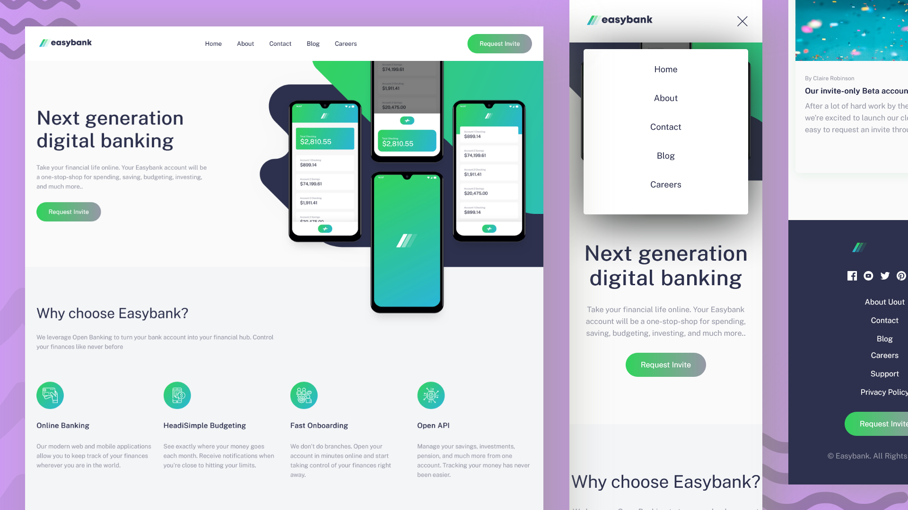

# Frontend Mentor-Easybank Landing Page Solution

A responsive landing page for Easybank created with HTML, CSS, and JavaScript.

## Screenshots

## View Live

You can view the live version of this project on GitHub Pages: [Easybank Landing Page](https://upovibe.github.io/FrontendMentor-Solutions/Easybank-landing-page/)

## View Code Repo
[Code Repo](https://github.com/upovibe/FrontendMentor-Solutions/tree/main/Easybank-landing-page/)

## Connect with Me

Feel free to connect with me on:

- [LinkedIn](https://www.linkedin.com/in/upovibe/)
- [x](https://www.x.com/iamupo/)
