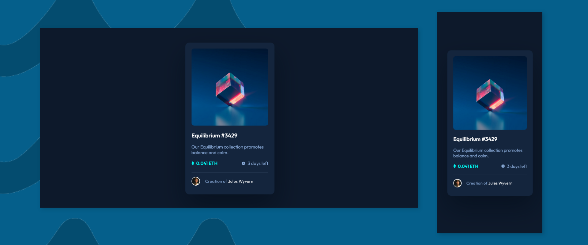

# Frontend Mentor - NFT preview card component solution

This is a solution to the [NFT preview card component challenge on Frontend Mentor](https://www.frontendmentor.io/challenges/nft-preview-card-component-SbdUL_w0U). Frontend Mentor challenges help you improve your coding skills by building realistic projects. 

## Built with

- Semantic HTML5 markup
- Plain CSS

## Screenshots

## View Live

You can view the live version of this project on GitHub Pages: [NFT-preview-card](https://upovibe.github.io/FrontendMentor-Solutions/NFT-preview-card/)

## View Code Repo

[Code Repo](https://github.com/upovibe/FrontendMentor-Solutions/edit/main/NFT-preview-card)

## Connect with Me

Feel free to connect with me on:

- [LinkedIn](https://www.linkedin.com/in/upovibe/)
- [x](https://www.x.com/upovibe/)
