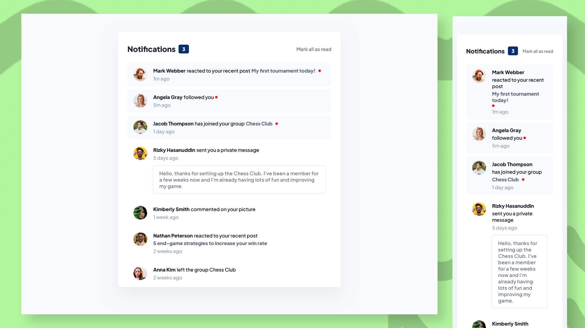

# Frontend Mentor - Notifications page

This is a solution to the [Notifications page](
https://www.frontendmentor.io/challenges/notifications-page-DqK5QAmKbC/hub)

## Built with

- Semantic HTML5 markup
- Plain CSS
- Javascript

## Screenshots

## View Live

You can view the live version of this project on GitHub Pages: [Notifications-page](https://iamupo.github.io/FrontendMentor-Solutions/Notifications-page/)

## View Code Repo

[Code Repo](https://github.com/IamUPO/FrontendMentor-Solutions/tree/main/Notifications-page)

## Connect with Me

Feel free to connect with me on:

- [LinkedIn](https://www.linkedin.com/in/iamupo/)
- [x](https://www.x.com/iamupo/)
