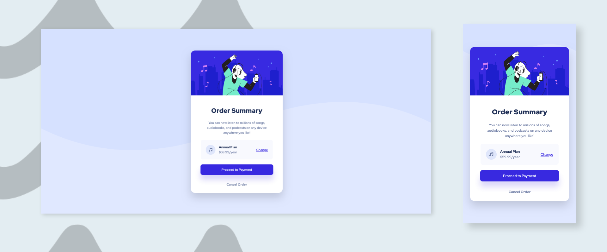

# Frontend Mentor - Order summary card solution

This is a solution to the [Order summary card challenge on Frontend Mentor](https://www.frontendmentor.io/challenges/order-summary-component-QlPmajDUj). Frontend Mentor challenges help you improve your coding skills by building realistic projects. 

## Built with

- Semantic HTML5 markup
- Plain CSS

## Screenshots

You can view the live version of this project on GitHub Pages: [Order-summary-card](https://upovibe.github.io/FrontendMentor-Solutions/Order-summary-card/)

## View Code Repo

[Code Repo](https://github.com/IamUPO/FrontendMentor-Solutions/edit/main/Order-summary-card/)

## Connect with Me

Feel free to connect with me on:

- [LinkedIn](https://www.linkedin.com/in/upovibe/)
- [x](https://www.x.com/upovibe/)
