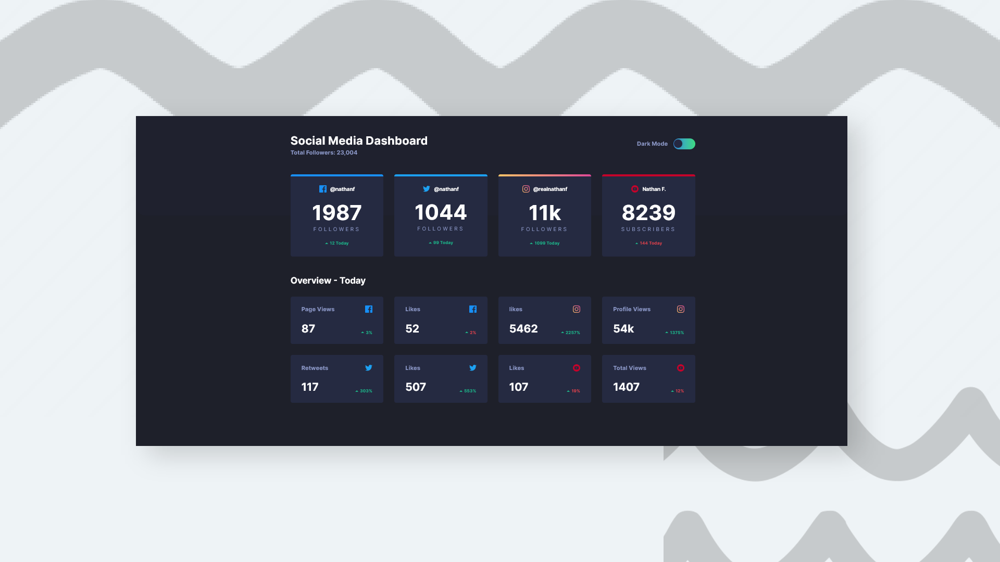

# Frontend Mentor - Social media dashboard with theme switcher

This is a solution to the [Social media dashboard with theme switcher challenge on Frontend Mentor](
https://www.frontendmentor.io/challenges/social-media-dashboard-with-theme-switcher-6oY8ozp_H/hub)

## Built with

- Semantic HTML5 markup
- Plain CSS
- Javascript

## Screenshots

## View Live

You can view the live version of this project on GitHub Pages: [Social media dashboard](https://iamupo.github.io/FrontendMentor-Solutions/Social-media-dashboard-with-theme-switcher/)

## View Code Repo
[Code Repo](https://github.com/IamUPO/FrontendMentor-Solutions/tree/main/Social-media-dashboard-with-theme-switcher/)

## Connect with Me

Feel free to connect with me on:

- [LinkedIn](https://www.linkedin.com/in/iamupo/)
- [x](https://www.x.com/iamupo/)
