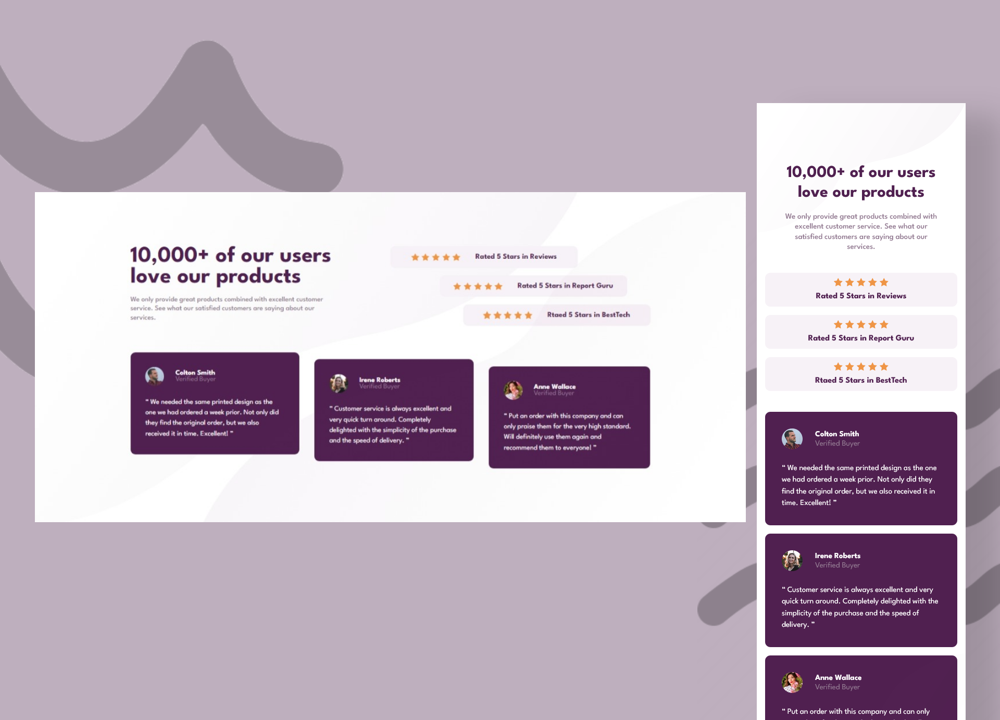

# Frontend Mentor - Social proof section solution

This is a solution to the [Social proof section challenge on Frontend Mentor](https://www.frontendmentor.io/challenges/social-proof-section-6e0qTv_bA). Frontend Mentor challenges help you improve your coding skills by building realistic projects. 

## Built with

- Semantic HTML5 markup
- Plain CSS

## Screenshots

## View Live

You can view the live version of this project on GitHub Pages: [Social proof section](https://iamupo.github.io/FrontendMentor-Solutions/Social-proof-section/)

## View Code Repo

[Code Repo](https://github.com/IamUPO/FrontendMentor-Solutions/tree/main/Social-proof-section)

## Connect with Me

Feel free to connect with me on:

- [LinkedIn](https://www.linkedin.com/in/iamupo/)
- [x](https://www.x.com/iamupo/)

