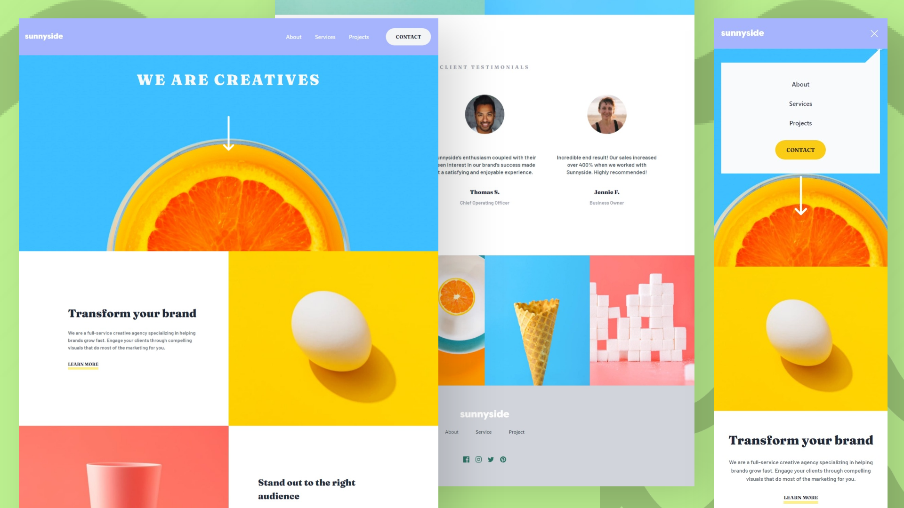

# Frontend Mentor - Sunnyside agency landing page solution

This is a solution to the [Sunnyside agency landing page challenge on Frontend Mentor](https://www.frontendmentor.io/challenges/sunnyside-agency-landing-page-7yVs3B6ef). Frontend Mentor challenges help you improve your coding skills by building realistic projects.

## Screenshots

## View Live

You can view the live version of this project on GitHub Pages: [Sunnyside-agency-landing-pagE](https://iamupo.github.io/FrontendMentor-Solutions/Sunnyside-agency-landing-page/)

## View Code Repo
[Code Repo](https://github.com/upovibe/FrontendMentor-Solutions/tree/main/Sunnyside-agency-landing-page/)

## Connect with Me

Feel free to connect with me on:

- [LinkedIn](https://www.linkedin.com/in/upovibe/)
- [x](https://www.x.com/upovibe/)
