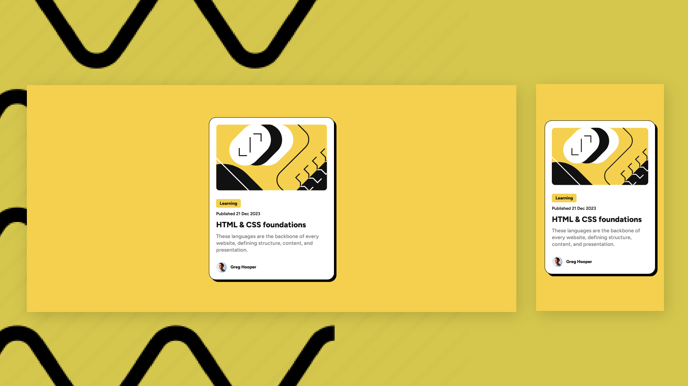

# Frontend Mentor - Blog preview card solution

This is a solution to the [Blog preview card challenge on Frontend Mentor](https://www.frontendmentor.io/challenges/blog-preview-card-ckPaj01IcS). Frontend Mentor challenges help you improve your coding skills by building realistic projects.

## Built with

- Semantic HTML5 markup
- CSS custom properties

## Screenshots

## View Live

You can view the live version of this project on GitHub Pages: [Blog preview](https://upovibe.github.io/FrontendMentor-Solutions/blog-preview-card-main/)

## View Code Repo
[Code Repo](https://github.com/upovibe/FrontendMentor-Solutions/tree/main/blog-preview-card-main)

## Connect with Me

Feel free to connect with me on:

- [LinkedIn](https://www.linkedin.com/in/upovibe/)
- [x](https://www.x.com/upovibe/)

