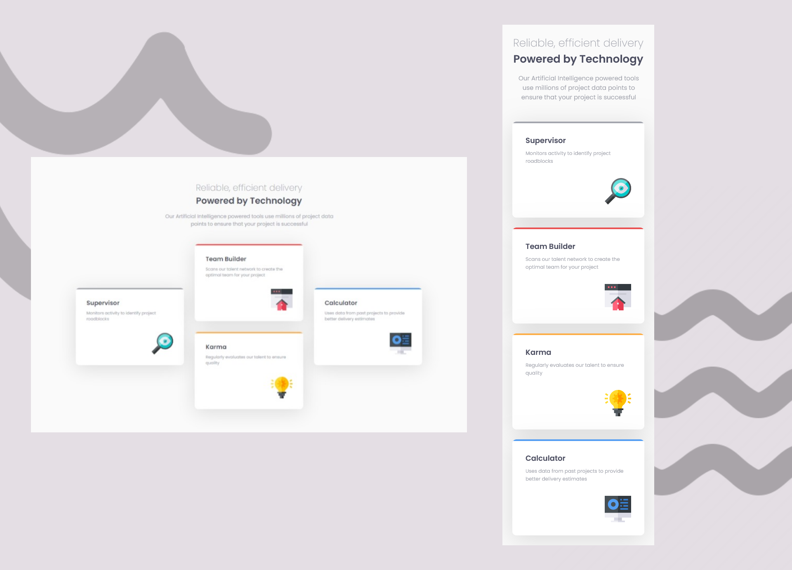

# Frontend Mentor - Four card feature section solution

This is a solution to the [Four card feature section challenge on Frontend Mentor](https://www.frontendmentor.io/challenges/four-card-feature-section-weK1eFYK). Frontend Mentor challenges help you improve your coding skills by building realistic projects. 

## Built with

- Semantic HTML5 markup
- Plain CSS

## Screenshots

## View Live

You can view the live version of this project on GitHub Pages: [Four card feature section](https://upovibe.github.io/FrontendMentor-Solutions/four-card-feature-section/)

## View Code Repo

[Code Repo](https://github.com/upovibe/FrontendMentor-Solutions/tree/main/four-card-feature-section)

## Connect with Me

Feel free to connect with me on:

- [LinkedIn](https://www.linkedin.com/in/upovibe/)
- [x](https://www.x.com/upovibe/)
