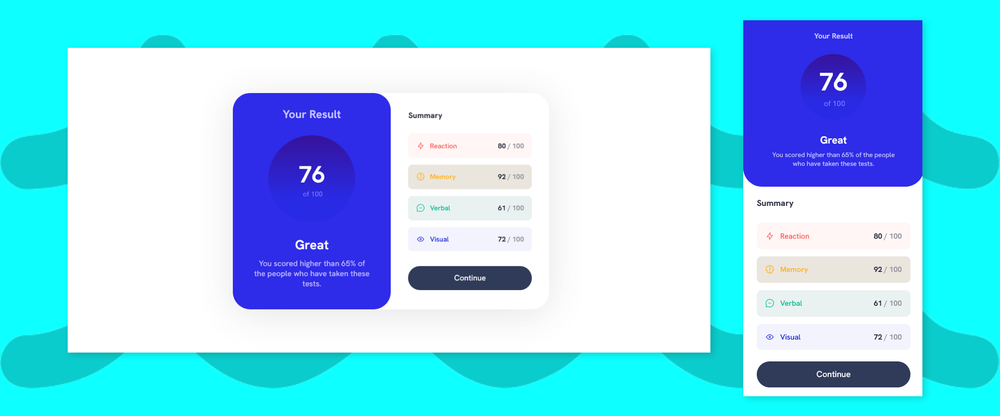

# Frontend Mentor - Results summary component solution

This is a solution to the [Results summary component challenge on Frontend Mentor](https://www.frontendmentor.io/challenges/results-summary-component-CE_K6s0maV). Frontend Mentor challenges help you improve your coding skills by building realistic projects. 

## Built with

- Semantic HTML5 markup
- Plain CSS

## Screenshots

## View Live

You can view the live version of this project on GitHub Pages: [Results-summary-component](https://iamupo.github.io/Frontend-Mentor-challenge/results-summary-component/)

## View Code Repo

[Code Repo](https://github.com/IamUPO/Frontend-Mentor-challenge/blob/main/results-summary-component)

## Connect with Me

Feel free to connect with me on:

- [LinkedIn](https://www.linkedin.com/in/iamupo/)
- [x](https://www.x.com/iamupo/)
