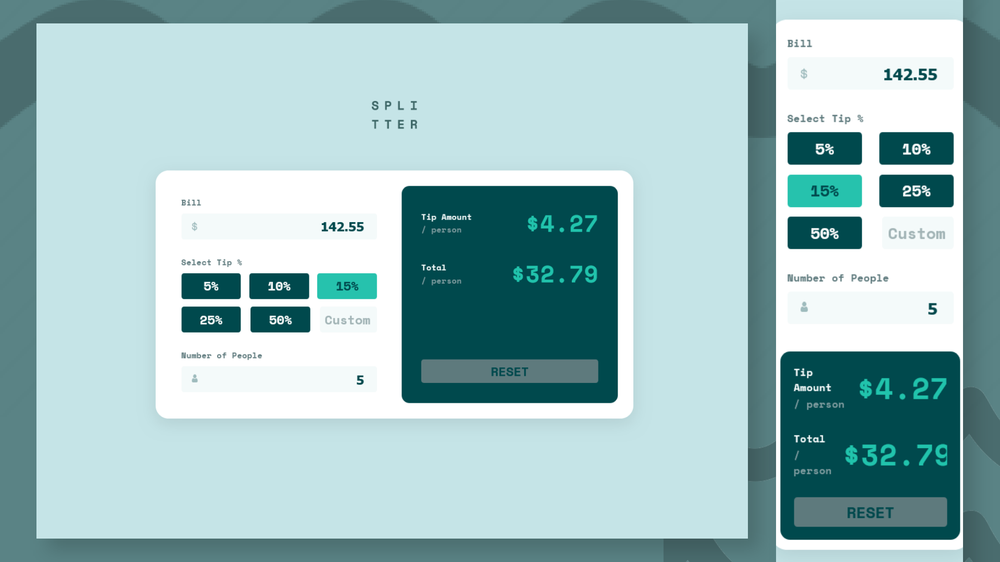

# Frontend Mentor - Tip calculator app solution

This is a solution to the [Tip calculator app challenge on Frontend Mentor](https://www.frontendmentor.io/challenges/tip-calculator-app-ugJNGbJUX). Frontend Mentor challenges help you improve your coding skills by building realistic projects.

## Built with

- Semantic HTML5 markup
- Plain CSS
- Javascript

## Screenshots

## View Live

You can view the live version of this project on GitHub Pages: [Tip calculator app](https://iamupo.github.io/FrontendMentor-Solutions//tip-calculator-app-main/)

## View Code Repo

[Code Repo](https://github.com/IamUPO/FrontendMentor-Solutions//tree/main/tip-calculator-app-main/)

## Connect with Me

Feel free to connect with me on:

- [LinkedIn](https://www.linkedin.com/in/iamupo/)
- [x](https://www.x.com/iamupo/)
